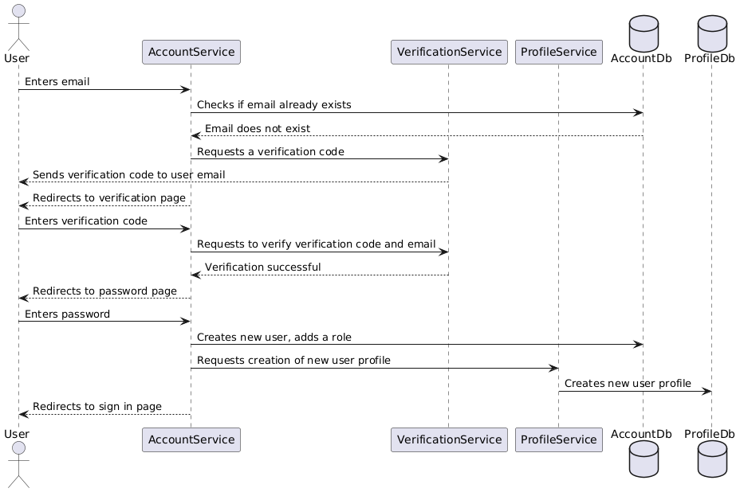

# VerificationServiceProvider

This service sends and verifies the email verification codes when users sign up. 

A verification code is valid for 5 minutes. 

Swagger documentation: https://ventixe-vsp-facafmejhdcaezdz.swedencentral-01.azurewebsites.net/index.html

This sequence diagram shows where in the sign up flow this system is used:

